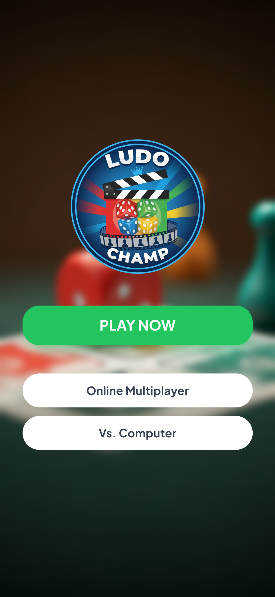
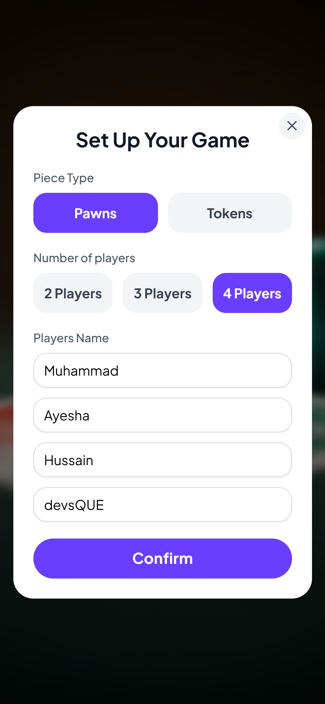
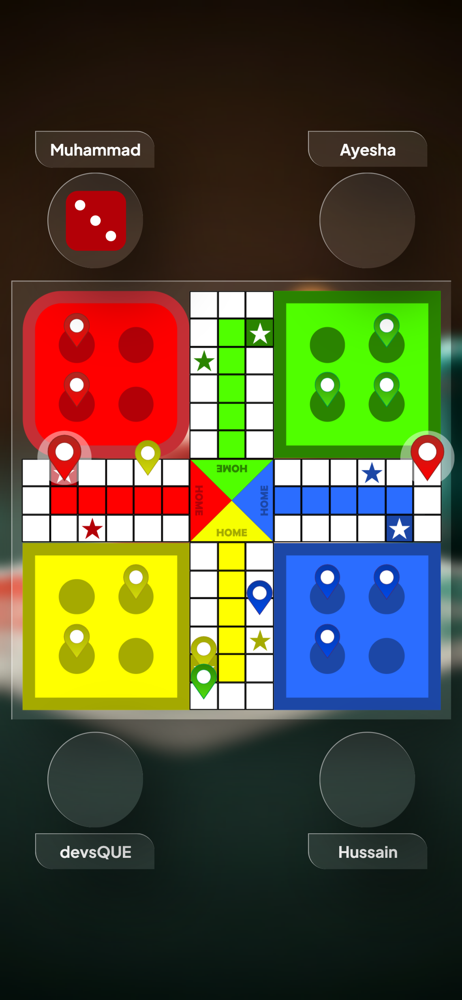

# LUDO Champ

  

## 🎲 LUDO Champ: The King of All Board Games!
Relive the nostalgic fun of the classic board game with LUDO Champ, the ultimate digital adaptation designed for modern players!

Whether you call it Pachisi, Parcheesi, or just Ludo, this game brings the royal challenge of strategy and luck right to your mobile device. Roll the dice, race your tokens, and outwit your opponents to conquer the board and become the LUDO Champ!

## 📸 Screenshots

<!-- Portrait Screenshots -->

  
  
  

## 👤 Developer
**Mohammad Hussain**  
GitHub: [@devsQUE](https://github.com/devsQUE)

